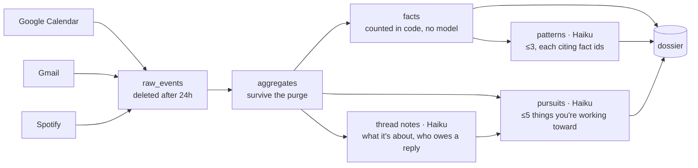
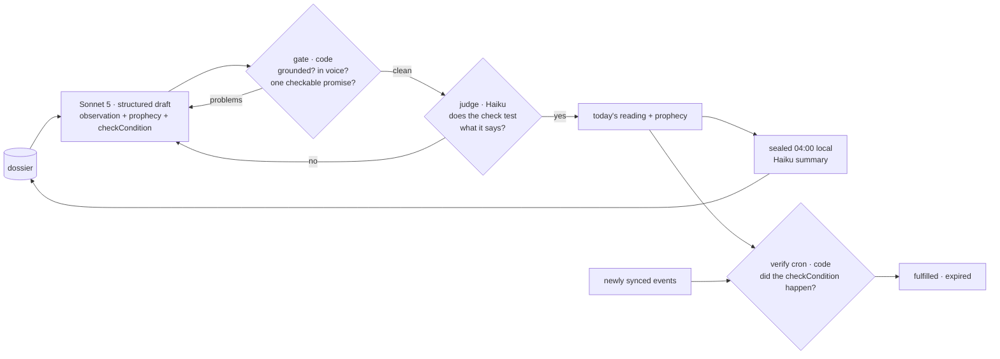
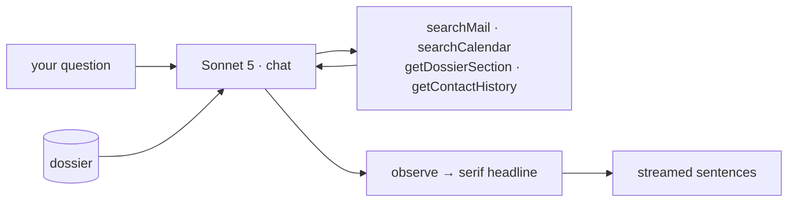

# Morrow

An AI fortune teller that "hot reads" your connected accounts. Observations are grounded in real data; prophecies are time-boxed and verified automatically against your sources. One reading a day, sealed at 04:00 local.

**Full product & engineering spec: [SPEC.md](./SPEC.md)** (source of truth, including the shared package contracts in §6).

## How it works

Two models, split by cost: **Haiku 4.5** reads the high-volume data, **Sonnet 5** writes the few sentences you
actually see. Everything counted or verified is deterministic code, so numbers can't hallucinate.

**From your accounts to the dossier** — everything Haiku reads, nothing Sonnet sees yet.



**The daily reading** — the only place Sonnet writes unprompted, and every draft has to survive two reviewers.



**A question** — Sonnet looks before it speaks, and the headline arrives a round trip before the sentences under it.




**Why it's shaped this way**

- **The models never see raw data.** Bodies and event details reach Haiku once, become a note, and are deleted with
  the raw event at 24h. Sonnet only ever sees the distilled dossier.
- **Grounding is enforced, not requested.** Every observation cites a fact id that must resolve; a draft that names a
  person, recites a schedule, leaks a count or promises more than its check can observe is rejected and regenerated.
- **Prophecies verify themselves.** Each carries a machine-checkable condition and a window, matched against new
  events by a cron job — no model in the loop.
- **Untrusted text stays data.** Event titles and email bodies are attacker-controlled; the red-team suite plants
  instructions in them and asserts Morrow never obeys, leaks its prompt, or emits links.

Quality is measured, not asserted: see [`apps/web/evals`](./apps/web/evals) and SPEC §13.

## Structure

```
apps/
  web/        Next.js 16 — web UI, API routes, cron jobs
  mobile/     Expo + Expo Router — iOS/Android client of the web API
packages/
  tokens/     @morrow/tokens — design tokens (TS) + generated tokens.css
  core/       @morrow/core — zod schemas, domain rules, API client, demo fixtures
```

Packages ship TypeScript source (no build step); Next.js consumes them via `transpilePackages`, Metro directly.

## Getting started

Requires Node 22 (`nvm use`) and pnpm 9.

```sh
pnpm install
pnpm dev          # all apps via Turborepo
pnpm typecheck
pnpm test
```

Regenerate CSS variables after editing tokens: `pnpm --filter @morrow/tokens build:css`.

## Demo mode

With no `AI_GATEWAY_API_KEY` and no `DATABASE_URL`, the web app runs entirely on the fixtures in `@morrow/core` (user Iris, 2026-09-30 09:12 America/Los_Angeles) with scripted Morrow responses. Copy `.env.example` to `apps/web/.env.local` to use real services.
